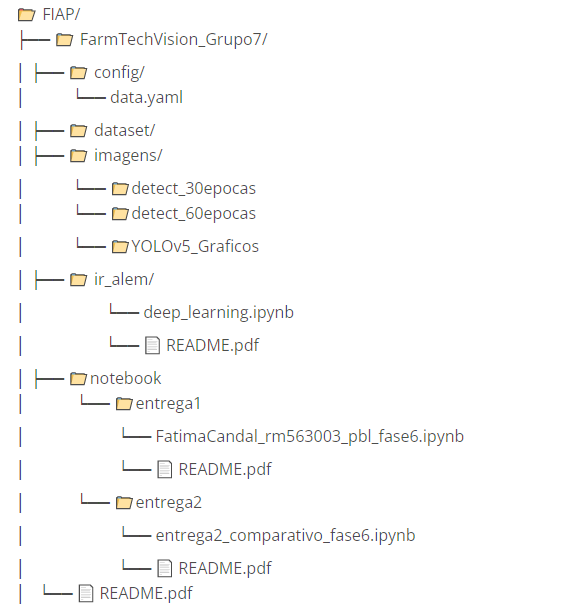
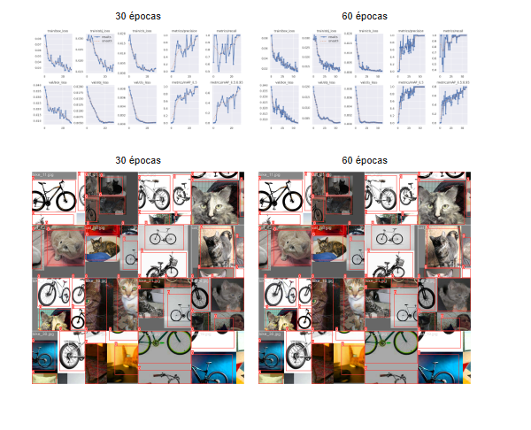

# Projeto FarmTech Solutions – Visão Computacional com YOLOv5

# 📁 **Sobre o Projeto**

## 📌 Projeto FarmTech Solutions – Visão Computacional com YOLOv5

Este projeto demonstra as soluções desenvolvidas para as Entregas 1 do projeto da disciplina PBL Fase 6 da FIAP, aplicando técnicas de Visão Computacional com YOLOv5,  com foco em dois objetos distintos: **cat** e **bike**. O objetivo é treinar um modelo capaz de identificar esses objetos com alta acurácia, validando seu uso em cenários reais da FarmTech Solutions. 

## 📌 Descrição do Projeto

A FarmTech Solutions está expandindo seus serviços de inteligência artificial
para além do agronegócio, atuando agora nas áreas de saúde animal, segurança
patrimonial, controle de acesso e análise de documentos. Como parte do time de
desenvolvedores, nosso objetivo foi demonstrar na prática o funcionamento de um
sistema de visão computacional utilizando YOLO, com foco em acurácia e
aplicabilidade.

           

# 📹 **Demonstração em Vídeo**

Assista ao vídeo com a explicação e funcionamento do projeto:

https://www.youtube.com/watch?v=hrjdB9EuElI

[FarmTechVision Grupo 18 - YouTube]

(https://youtu.be/hrjdB9EuElI)

            

## 📌 **Objetivo**

Demonstrar o uso de YOLOv5 para detecção de objetos em imagens, com aplicação prática para clientes da FarmTech Solutions.

[FarmTechVision - Google Drive]

https://drive.google.com/drive/folders/1e6rJrdMxQRRpNJW-nlHGcV0AqA_5cumV

[FIAP/FarmTechVision · rm563003/FIAP · GitHub]

https://github.com/rm563003/FIAP/tree/main/FarmTechVision_Grupo7

            

## 🗂**️** **Estrutura do Repositório GITHUB**

Os arquivos estão no GITHUB:

https://github.com/rm563003/FIAP/tree/main/FarmTechVision_Grupo7

## 

## 🗂**️** DATASET GOOGLE DRIVE

O conjunto de dados foi organizado no Google Drive e contém:

-  **80 imagens no total**

-  40 imagens de gatos (cat)   

-  40 imagens de bicicletas (bike) - Separadas em:

-  32 para treino

-  4 para validação

-  4 para teste

-  Rotuladas com [Make Sense IA] (https://www.makesense.ai/) e salvas no formato YOLO.

## 🔗 Acesse o dataset completo no Google Drive:

https://drive.google.com/drive/folders/1qkNb4RV7mHWI3fwiyvHKzPm7rb9KBSKN

/FarmTechVision_Grupo7/

  └── dataset/

      ├── images/

      │   ├── train/

      │   ├── val/

      │   └── test/

      └── labels/

          ├── train/

          ├── val/

          └── test/

## 🚀 Entrega 1 – YOLOv5 Customizado

## [FatimaCandal_rm563003_pbl_fase6.ipynb - Colab]

https://colab.research.google.com/drive/17r-pJUDiiel7gbe-Dt6pAYz_TpRnsdoh

## 

## 🚀 **Treinamento**

-   Dois modelos treinados: 30 e 60 épocas

-   Comparação de desempenho e acurácia

- O modelo YOLOv5 foi treinado em duas configurações:

-   **Treinamento 1**: 30 épocas

https://drive.google.com/drive/folders/1GNTK54SlLoN4LtkTbNyjCNbWyLFeVwhP

-   **Treinamento 2**: 60 épocas

https://drive.google.com/drive/folders/1lrif1HiMNxfmbBn5fnEBiN4T8EeIdDIK

As comparações de desempenho, acurácia e tempo de execução estão documentadas no notebook.

               

## 📷 **Resultados**

## 📷 Prints das detecções “detect_30epocas”

[https://drive.google.com/drive/folders/1GNTK54SlLoN4LtkTbNyjCNbWyLFeVw](https://drive.google.com/drive/folders/1GNTK54SlLoN4LtkTbNyjCNbWyLFeVwhP?usp=drive_link)

# 

## 📷  **Avaliação dos modelos “detect_30epocas”**

 

## [YOLOv5_Graficos - Google Drive]

https://drive.google.com/drive/folders/1ZxtzbTUtuOcnu7liDHek1MWhoi8lwZDb

## 📊 **Análise Técnica dos Gráficos de Treinamento e Validação** **– YOLOv5 -  detect_30epocas”**

Os gráficos apresentados representam o comportamento do
modelo YOLOv5 ao longo das épocas de treinamento, com foco nas perdas (losses)
e nas métricas de desempenho. A presença das curvas "results" e
"smooth" permite observar tanto os valores reais quanto a tendência
geral de cada métrica.

**---**

## 📉 **Perdas de Treinamento (`train/box_loss`, `train/obj_loss`, `train/cls_loss`) - “detect_30epocas”**

As perdas de treinamento mostram uma **tendência decrescente
clara**, especialmente nas primeiras épocas, o que indica que o modelo está
aprendendo a ajustar suas predições. A perda de caixa (`box_loss`) caiu
rapidamente e estabilizou, sugerindo que o modelo está localizando bem os
objetos. As perdas de objeto (`obj_loss`) e de classe (`cls_loss`) também
diminuíram de forma consistente, o que é um sinal positivo de aprendizado.

**---**

## 📉 Perdas de Validação (`val/box_loss`, `val/obj_loss`,`val/cls_loss`) - “detect_30epocas”

As perdas de validação acompanharam a tendência das perdas
de treinamento, com valores semelhantes e estáveis. Isso indica que o modelo
está **generalizando bem** para dados que ele nunca viu. A ausência de aumento
nas perdas de validação nas últimas épocas sugere que **não houve
overfitting**.

**---**

## 🎯 **Métricas de Precisão e Revocação (`metrics/precision`,**

## `metrics/recall`) - “detect_30epocas”

A **precisão** aumentou ao longo das épocas e se estabilizou
em valores elevados, próximos de 0.9, indicando que o modelo está fazendo
predições corretas com baixa taxa de falsos positivos. A **revocação** atingiu
valores próximos de 1.0, o que significa que o modelo está detectando
praticamente todos os objetos presentes nas imagens.

**---** 

## 📈 **Precisão Média (`metrics/mAP_0.5` e**## `metrics/mAP_0.5:0.95`) - “detect_30epocas”

A métrica `mAP@0.5` ultrapassou 0.98, o que representa um desempenho excelente em termos de detecção com IoU ≥ 0.5. Já o `mAP@0.5:0.95`, que é mais exigente, atingiu valores superiores a 0.54, indicando que o modelo também está performando bem em múltiplos níveis de sobreposição entre predições e objetos reais.

**---**

## 📈 Interpretação Geral - “detect_30epocas”

- O modelo apresentou **aprendizado consistente**, com perdas decrescentes e métricas de desempenho crescentes.

- A **estabilização das curvas** nas últimas épocas sugere que o modelo atingiu um bom ponto de convergência.

- A **ausência de divergência entre treino e validação** reforça a qualidade do dataset e a eficácia do treinamento.

- As métricas finais indicam que o modelo está **pronto para ser testado em cenários reais**, com alta confiabilidade na detecção de objetos.

**---**

Esses resultados demonstram que o treinamento foi bem-sucedido e que o modelo YOLOv5 está apto para aplicações práticas em visão computacional, como segurança patrimonial, monitoramento animal ou controle de acesso em ambientes rurais e urbanos.

## 📷 **Prints das detecções “detect_60epocas”**

 [https://drive.google.com/drive/folders/1lrif1HiMNxfmbBn5fnEBiN4T8EeIdD](https://drive.google.com/drive/folders/1lrif1HiMNxfmbBn5fnEBiN4T8EeIdDIK?usp=drive_link)

# 

## 📷  **Avaliação dos modelos “detect_60epocas”**

 

## [YOLOv5_Graficos - Google Drive]

https://drive.google.com/drive/folders/1ZxtzbTUtuOcnu7liDHek1MWhoi8lwZDb

## 📊 **Análise Técnica dos Gráficos de Treinamento e Validação **– YOLOv5 - “detect_60epocas”**

Os gráficos gerados durante o treinamento do modelo YOLOv5 fornecem insights valiosos sobre o comportamento do modelo ao longo das épocas.
A seguir, apresentamos uma análise detalhada das principais métricas
observadas:

**---**

## 📉 Perdas de Treinamento (`train/box_loss`, `train/obj_loss`, `train/cls_loss`) - “detect_60epocas”

As curvas de perda de treinamento mostram uma **tendência decrescente consistente**, indicando que o modelo está aprendendo a representar
melhor os objetos ao longo das épocas. A perda de caixa (`box_loss`) teve uma
queda significativa nas primeiras épocas e estabilizou em valores baixos, o que
é desejável. As perdas de objeto (`obj_loss`) e de classe (`cls_loss`) também
diminuíram progressivamente, sugerindo que o modelo está se ajustando bem às
tarefas de detecção e classificação.

**---**

## 📉 **Perdas de Validação (`val/box_loss`, `val/obj_loss`,**

## `val/cls_loss`) - “detect_60epocas”

As perdas de validação seguiram uma tendência semelhante às de treinamento, com **valores próximos e estáveis**, o que indica que o modelo está generalizando bem para dados que ele nunca viu. Não há sinais evidentes de overfitting, já que as perdas não aumentaram nas últimas épocas.

**---**

## 🎯 **Métricas de Precisão e Revocação (`metrics/precision`,**

## metrics/recall`) - “detect_60epocas”

A **precisão** apresentou crescimento ao longo das épocas, estabilizando em valores próximos de **0.9**, o que indica que o modelo está fazendo predições corretas com baixa taxa de falsos positivos. A **revocação ** atingiu valores próximos de **1.0**, mostrando que o modelo está conseguindo detectar praticamente todos os objetos presentes nas imagens.

**---** 

## 📈 Precisão Média (`metrics/mAP_0.5` e  `metrics/mAP_0.5:0.95`)

A métrica `mAP@0.5` ultrapassou **0.98**, o que representa um desempenho excelente em termos de detecção com IoU ≥ 0.5. Já o `mAP@0.5:0.95`, que é uma métrica mais exigente, atingiu valores superiores a **0.54**, indicando que o modelo também está performando bem em múltiplos níveis de sobreposição entre predições e objetos reais.

**---**

## 📈 Interpretação Geral “detect_60epocas”

- O modelo apresentou **aprendizado consistente**, com perdas decrescentes e métricas de desempenho crescentes.

- A **estabilização das curvas** nas últimas épocas sugere que o modelo atingiu um bom ponto de convergência.

- A **ausência de divergência entre treino e validação** reforça a qualidade do dataset e a eficácia do treinamento.

- As métricas finais indicam que o modelo está **pronto para ser testado em cenários reais**, com alta confiabilidade na detecção de objetos.

****

Esses resultados demonstram que o treinamento foi bem-sucedido e que o modelo YOLOv5 está apto para aplicações práticas em visão computacional, como segurança patrimonial, monitoramento animal ou controle de acesso em ambientes rurais e urbanos.

## 🔄 **Comparação entre Treinamentos com 30 e 60 Épocas – YOLOv5**

Realizamos dois treinamentos distintos com o modelo YOLOv5, utilizando o mesmo dataset, mas variando a quantidade de épocas: 30 e 60. A seguir, apresentamos uma análise comparativa das principais métricas de desempenho.

# 📈 **Métricas de Avaliação**

| **Métrica**       | **30 Épocas** | **60 Épocas** | **Diferença** |
| ----------------- | ------------- | ------------- | ------------- |
| **Precisão (P)**  | 0.87          | 0.93          | +0.06         |
| **Revocação (R)** | 1.00          | 1.00          | =             |
| **mAP@0.5**       | 0.982         | 0.995         | +0.013        |
| **mAP@0.5:0.95**  | 0.544         | 0.612         | +0.068        |
| **Perda total**   | 0.0412        | 0.0362        | –0.005        |

  

### [YOLOv5_Graficos - Google Drive]

https://drive.google.com/drive/folders/1ZxtzbTUtuOcnu7liDHek1MWhoi8lwZDb

# 

# 📈 Resultados Visuais

## Segue estão os prints das imagens de teste processadas pelo modelo, com as detecções realizadas.

# 📈 Interpretação

- O modelo treinado com **60 épocas** apresentou **melhor desempenho em todas as
  métricas**, especialmente em mAP@0.5:0.95, que é mais exigente.

- A **perda total foi menor**, indicando que o modelo aprendeu melhor a representar
  os objetos.

- Ambos os modelos atingiram **revocação máxima (1.00)**, mas o de 60 épocas teve
  **maior precisão**, o que significa menos falsos positivos.

- A evolução entre os dois treinamentos mostra que o modelo continua aprendendo após 30 épocas, sem sinais de overfitting.

- Treinamentos mais longos resultam em modelos mais precisos e robustos. Para aplicações reais em visão computacional, recomenda-se utilizar pelo menos **60 épocas** para maximizar o desempenho.

      

# 📈 **Conclusões**

-   Modelo com 60 épocas teve melhor desempenho

-   Sistema viável para aplicações reais

-   O modelo com 60 épocas apresentou melhor
  desempenho geral.

-   O sistema é viável para aplicações reais da FarmTech Solutions, como segurança
  patrimonial e controle de acessos.

-   A limitação principal foi o tamanho reduzido do dataset, que pode ser expandido
  em versões futuras.

               

# 👥 **Autores**

## Grupo 18 — FIAP

### •       Fátima Vilela Candal

### •       Gabriel Viel dos Santos Delfino

### •       Guilherme Campos Hermanowski

### •       Jonathan Willian Luft

### •       Matheus Alboredo Soares
