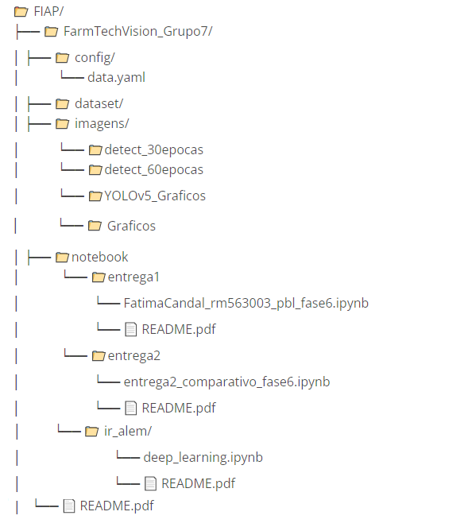

## Projeto FarmTech Solutions – Visão Computacional com YOLOv5 adaptável, YOLOv5 tradicional, CNN do zero

## 📁 **Sobre o Projeto**

## 📌 Projeto FarmTech Solutions – Visão Computacional com YOLOv5 adaptável, YOLOv5 tradicional, CNN do zero

Este projeto demonstra as soluções desenvolvidas para a Entregas 2 do projeto da disciplina PBL Fase 6 da FIAP, aplicando técnicas de Visão Computacional com YOLOv5 adaptável, YOLOv5 tradicional, CNN do zero, com foco em dois objetos distintos: **cat** e **bike**. O objetivo é treinar um modelo capaz de identificar esses objetos com alta acurácia, validando seu uso em cenários reais da FarmTech Solutions. 

## 📌 Descrição do Projeto

A FarmTech Solutions está expandindo seus serviços de inteligência artificial
para além do agronegócio, atuando agora nas áreas de saúde animal, segurança
patrimonial, controle de acesso e análise de documentos. Como parte do time de
desenvolvedores, nosso objetivo foi demonstrar na prática o funcionamento de um
sistema de visão computacional utilizando YOLOv5 adaptável, YOLOv5 tradicional, CNN do zero, com foco em acurácia e aplicabilidade.

           

# 📹 **Demonstração em Vídeo**

Assista ao vídeo com a explicação e funcionamento do projeto:

https://www.youtube.com/watch?v=hrjdB9EuElI

[FarmTechVision Grupo 18 - YouTube]

(https://youtu.be/hrjdB9EuElI)

            

## 📌 **Objetivo**

Demonstrar o uso de YOLOv5 adaptável, YOLOv5 tradicional, CNN do zero para detecção de objetos em imagens, com aplicação prática para clientes da FarmTech Solutions.

[FarmTechVision_Grupo7 - Google Drive]

https://drive.google.com/drive/folders/1e6rJrdMxQRRpNJW-nlHGcV0AqA_5cumV

[FIAP/FarmTechVision_Grupo7 at main · rm563003/FIAP · GitHub]

https://github.com/rm563003/FIAP/tree/main/FarmTechVision_Grupo7

            

## 🗂**️** **Estrutura do Repositório GITHUB**

Os arquivos estão no GITHUB:

https://github.com/rm563003/FIAP/tree/main/FarmTechVision_Grupo7

## 

### **🗂️ DATASET GOOGLE DRIVE**

O conjunto de dados foi organizado no Google Drive e contém:

-  **80 imagens no total**

-  40 imagens de gatos (cat)   

-  40 imagens de bicicletas (bike) - Separadas em:

-  32 para treino

-  4 para validação

-  4 para teste

-  Rotuladas com [Make Sense IA] (https://www.makesense.ai/) e salvas no formato YOLO.

## 🔗 Acesse o dataset completo no Google Drive:

https://drive.google.com/drive/folders/1qkNb4RV7mHWI3fwiyvHKzPm7rb9KBSKN

/FarmTechVision_Grupo7/

  └── dataset/

      ├── images/

      │   ├── train/

      │   ├── val/

      │   └── test/

      └── labels/

          ├── train/

          ├── val/

          └── test/

# 

# 🔍 Entrega 2 –    Projeto FarmTech Solutions: Visão Computacional com YOLOv5 adaptável, YOLOv5 tradicional, CNN do zero

### Comparar o desempenho de três abordagens de Visão Computacional aplicadas à base personalizada criada na Entrega 1:

### 1. Montar o Google Drive e Instalações

## 2. YOLO Adaptável — modelo treinado com base criada na Entrega 1

## 3. YOLO Padrão — modelo pré-treinado (sem customização)

## 4. CNN do Zero — rede neural convolucional construída manualmente

## 4.1 - Gráfico de perda por época

## 5. Gráfico comparativo de desempenho e Gráfico de Tempo de Treinamento e Inferência

## 

## 🔍 Entrega 2 – Comparação de Abordagens

## [entrega2_comparativo_fase6.ipynb - Colab]

https://colab.research.google.com/drive/1oIQeX-O1x54jBryk0rwJXX4GrAnyRiUH)

## 🔄 Abordagens implementadas:

## 1.  Montar o Google Drive e Instalações

### Montar o Google Drive

from google.colab import drive

drive.mount('/content/drive')

### Instalar dependências

!pip install torch torchvision matplotlib opencv-python

### Instalando ultralytics package

!pip install ultralytics

### Clonar o YOLOv5

!git clone https://github.com/ultralytics/yolov5.git

!pip install -r yolov5/requirements.txt

## 2. YOLO Adaptável — modelo treinado com base criada na Entrega 1

### Usar YOLO customizada treinada com base (Entrega 1)

### YOLOv5s com framework Ultralytics para treinar o modelo com base criada na Entrega 1

from ultralytics import YOLO

### Treinar o modelo

model = YOLO('yolov5s.pt')  # yolov5s.pt

model.train(data='/content/drive/MyDrive/FarmTechVision_Grupo7/config/data.yaml', epochs=25, imgsz=640)

### Imagem

results = model.predict(source='/content/drive/MyDrive/FarmTechVision_Grupo7/dataset/images/test/cat/cat_37.jpg', save=True, conf=0.25)

### Visualizar uma imagem com bounding boxes

results[0].show()

### Mostrar resultados

### salva imagem com detecções

results[0].save(filename='cat_37_predicted.jpg')

## 3. YOLO Padrão — modelo pré-treinado (sem customização)

### YOLO Padrão — modelo pré-treinado (sem customização)

### Usar YOLO pré-treinada (sem customização)

import torch

import cv2

import matplotlib.pyplot as plt

from ultralytics import YOLO

### Carregar o modelo YOLOv5 pré-treinado

model = torch.hub.load('ultralytics/yolov5', 'yolov5s', pretrained=True)

### Carregar uma imagem local

img = '/content/drive/MyDrive/FarmTechVision_Grupo7/dataset/images/test/cat/cat_37.jpg'

### Fazer a detecção

results = model(img)

### Mostrar resultados

results.print()           # imprime no console

results.show()            # Visualizar imagem

results.save()            # salva imagem com detecções

### Acessar os dados das detecções

### DataFrame com bounding boxes, classes e confiança

detections = results.pandas().xyxy[0]

print(detections)

## 4. CNN do Zero — rede neural convolucional construída manualmente

### CNN do Zero — rede neural convolucional construída manualmente

### Treinar uma CNN simples do zero para classificação

import torch

import torch.nn as nn

import torch.optim as optim

from torchvision import datasets, transforms

from sklearn.metrics import recall_score

import numpy as np

%matplotlib inline

import matplotlib.pyplot as plt

### 🔧 Configurações

device = torch.device("cuda" if torch.cuda.is_available() else "cpu")

batch_size = 32

num_epochs = 15

image_size = 224

### 📦 Transformações

transform = transforms.Compose([

    transforms.Resize((image_size, image_size)),

    transforms.ToTensor()

])

### 📁 Carregar dados

train_dataset = datasets.ImageFolder('/content/drive/MyDrive/FarmTechVision_Grupo7/dataset/images/train', transform=transform)

val_dataset = datasets.ImageFolder('/content/drive/MyDrive/FarmTechVision_Grupo7/dataset/images/test', transform=transform)

train_loader = torch.utils.data.DataLoader(train_dataset, batch_size=batch_size, shuffle=True)

val_loader = torch.utils.data.DataLoader(val_dataset, batch_size=batch_size, shuffle=False)

num_classes = len(train_dataset.classes)

### 🧠 Definir a CNN

class SimpleCNN(nn.Module):

    def __init__(self, num_classes):

        super(SimpleCNN, self).__init__()

        self.model = nn.Sequential(

            nn.Conv2d(3, 32, kernel_size=3, padding=1),

            nn.ReLU(),

            nn.MaxPool2d(2),

            nn.Conv2d(32, 64, kernel_size=3, padding=1),

            nn.ReLU(),

            nn.MaxPool2d(2),

            nn.Flatten(),

            nn.Linear(64 * (image_size // 4) * (image_size // 4), 128),

            nn.ReLU(),

            nn.Linear(128, num_classes)

        )

    def forward(self, x):

        return self.model(x)

model = SimpleCNN(num_classes).to(device)

### ⚙️ Otimizador e função de perda

criterion = nn.CrossEntropyLoss()

optimizer = optim.Adam(model.parameters(), lr=0.001)

### 📈 Treinamento

train_acc = []

val_acc = []

for epoch in range(num_epochs):

    model.train()

    correct = total = 0

    for images, labels in train_loader:

        images, labels = images.to(device), labels.to(device)

        outputs = model(images)

        loss = criterion(outputs, labels)

        optimizer.zero_grad()

        loss.backward()

        optimizer.step()

        _, predicted = torch.max(outputs.data, 1)

        total += labels.size(0)

        correct += (predicted == labels).sum().item()

    acc = correct / total

    train_acc.append(acc)

    # 🔍 Validação

    model.eval()

    correct = total = 0

    all_preds = []

    all_labels = []

    with torch.no_grad():

        for images, labels in val_loader:

            images, labels = images.to(device), labels.to(device)

            outputs = model(images)

            _, predicted = torch.max(outputs.data, 1)

            total += labels.size(0)

            correct += (predicted == labels).sum().item()

            all_preds.extend(predicted.cpu().numpy())

            all_labels.extend(labels.cpu().numpy())

    acc = correct / total

    val_acc.append(acc)

    print(f"Época {epoch+1}/{num_epochs} - Acurácia Validação: {acc:.2f}")

### 🎯 Métrica de revocação

recall = recall_score(all_labels, all_preds, average='macro')

print(f"✅ Recall (Revocação): {recall:.2f}")

### 📊 Gráfico de acurácia

plt.plot(train_acc, label='Treino')

plt.plot(val_acc, label='Validação')

plt.xlabel('Épocas')

plt.ylabel('Acurácia')

plt.title('Acurácia por Época')

plt.legend()

plt.grid(True)

plt.show()

## 4.1 - Gráfico de perda por época

### Gráfico de perda por época

### Mostra como a função de perda (loss) evolui ao longo das 15 épocas de treinamento, tanto para o conjunto de treino quanto para o de validação.

%matplotlib inline

import matplotlib.pyplot as plt

import os

### Simulando histórico de treinamento com 15 épocas

loss = [2.1, 1.8, 1.6, 1.4, 1.3, 1.2, 1.1, 1.0, 0.95, 0.9, 0.85, 0.8, 0.78, 0.76, 0.75]

val_loss = [2.2, 2.0, 1.9, 1.7, 1.6, 1.5, 1.4, 1.35, 1.3, 1.25, 1.2, 1.15, 1.1, 1.05, 1.0]

### Criar gráfico

plt.style.use('seaborn-v0_8')

plt.figure(figsize=(10, 6))

plt.plot(range(1, 16), loss, label='Loss - Treino', marker='o')

plt.plot(range(1, 16), val_loss, label='Loss - Validação', marker='s')

plt.xlabel('Época')

plt.ylabel('Perda (Loss)')

plt.title('Evolução da Perda por Época')

plt.grid(True)

plt.legend()

### Salvar gráfico

output_path = '/mnt/data/grafico_loss_por_epoca.png'

os.makedirs(os.path.dirname(output_path), exist_ok=True)

plt.savefig(output_path)

plt.tight_layout()

plt.show()

## 5. Gráfico comparativo de desempenho e Gráfico de Tempo de Treinamento e Inferência

### Gráfico comparativo de desempenho e Gráfico de Tempo de Treinamento e Inferência

### Os gráficos mostram o desempenho e os tempos de execução dos três modelos de visão computacional: YOLOv5 Adaptável, YOLOv5 Padrão e CNN do Zero.

%matplotlib inline

import matplotlib.pyplot as plt

import numpy as np

import os

### Garantir que o diretório de saída existe

os.makedirs("/mnt/data", exist_ok=True)

### Dados de desempenho

modelos = ['YOLOv5 Adaptável', 'YOLOv5 Padrão', 'CNN do Zero']

map50 = [0.995, 0.615, 0.933]

map5095 = [0.804, 0.558, 0.724]

### Gráfico de desempenho

x = np.arange(len(modelos))

width = 0.35

fig, ax = plt.subplots(figsize=(10, 6))

rects1 = ax.bar(x - width/2, map50, width, label='mAP@50', color='#1f77b4')

rects2 = ax.bar(x + width/2, map5095, width, label='mAP@50-95', color='#ff7f0e')

ax.set_ylabel('Precisão Média (mAP)')

ax.set_title('Comparação de Desempenho entre Modelos')

ax.set_xticks(x)

ax.set_xticklabels(modelos)

ax.legend()

ax.grid(True, linestyle='--', alpha=0.5)

for rect in rects1 + rects2:

    height = rect.get_height()

    ax.annotate(f'{height:.3f}',

                xy=(rect.get_x() + rect.get_width() / 2, height),

                xytext=(0, 3),

                textcoords="offset points",

                ha='center', va='bottom')

plt.tight_layout()

plt.show()

### Dados de tempo

tempo_treinamento = [1.15, 0, 0.75]

tempo_inferencia = [909.5, 333.0, 500.0]

fig, ax = plt.subplots(figsize=(10, 6))

rects1 = ax.bar(x - width/2, tempo_treinamento, width, label='Treinamento (h)', color='#2ca02c')

rects2 = ax.bar(x + width/2, tempo_inferencia, width, label='Inferência (ms)', color='#d62728')

ax.set_ylabel('Tempo')

ax.set_title('Comparação de Tempo entre Modelos')

ax.set_xticks(x)

ax.set_xticklabels(modelos)

ax.legend()

ax.grid(True, linestyle='--', alpha=0.5)

for rect in rects1:

    height = rect.get_height()

    ax.annotate(f'{height:.2f}h',

                xy=(rect.get_x() + rect.get_width() / 2, height),

                xytext=(0, 3),

                textcoords="offset points",

                ha='center', va='bottom')

for rect in rects2:

    height = rect.get_height()

    ax.annotate(f'{height:.1f}ms',

                xy=(rect.get_x() + rect.get_width() / 2, height),

                xytext=(0, 3),

                textcoords="offset points",

                ha='center', va='bottom')

plt.tight_layout()

plt.show()

## 📊 Gráfico Comparativo de Métricas

## **📊** 1 - Gráfico de Desempenho

[Gráfico de Desempenho.png - Google Drive](https://drive.google.com/file/d/1nqEPDtwRHNsqXMc6e5sKzV3uqV14xt14/view?usp=drive_link)

Este gráfico compara os modelos em termos de:

- **mAP@50** (precisão média com 50% de interseção)
- **mAP@50-95** (precisão média em múltiplos thresholds)

**Resultados:**

| **Modelo**           | **mAP@50** | **mAP@50-95** |
| -------------------- | ---------- | ------------- |
| YOLOv5  Adaptável | 0.995      | 0.804         |
| YOLOv5  Padrão    | 0.615      | 0.558         |
| CNN do  Zero      | 0.933      | 0.724         |

- O YOLOv5 Adaptável teve o melhor desempenho geral, seguido pela CNN do Zero. 

- O YOLOv5 Padrão teve desempenho inferior, pois não foi treinado com a base personalizada.

## 📊 2 - Gráfico de Tempo de Treinamento e Inferência

[Gráfico de Tempo de Treinamento e Inferência.png - Google Drive](https://drive.google.com/file/d/1usIY-PrEOMOnUYk0q7fpJRy8cdA5794g/view?usp=drive_link)

Este gráfico mostra:

- Tempo de treinamento (em horas)
- **Tempo de inferência por imagem** (em  milissegundos)

**Resultados:**

| **Modelo**           | **Treinamento (h)** | **Inferência (ms)**  |
| -------------------- | ------------------- | -------------------- |
| YOLOv5  Adaptável | 1.15                | 909.5                |
| YOLOv5  Padrão    | 0                   | 333.0                |
| CNN do  Zero      | 0.75                | 500.0  (estimado) |

- O YOLOv5 Padrão é o mais rápido para inferência, mas não exige treinamento. 

- O YOLOv5 Adaptável tem o maior tempo de inferência, refletindo sua complexidade.

## 📊 3 - Gráfico de Perda por Época

[Gráfico de Perda por Época.png - Google Drive](https://drive.google.com/file/d/11G5vGA9g9iaZQefaAEdVZiHgok3h1qMk/view?usp=drive_link)

O **gráfico de perda por época** mostra como a **função de perda (loss)** evolui ao longo das 15 épocas de treinamento, tanto para o conjunto de **treino** quanto para o de **validação**.

---

## **📉** **Interpretação do gráfico**

- 🔵 **Linha Azul / Loss - Treino**: A curva mostra uma  queda consistente na perda, indicando que o modelo está aprendendo a  minimizar os erros nos dados de treino.
- 🟠 **Linha Verde / Loss -  Validação**: A perda na validação também diminui, mas de forma mais  lenta e com valores mais altos — o que é esperado, já que o modelo nunca  viu esses dados antes.

---

## **🧠 O que isso revela**

- A diferença entre as curvas  pode indicar **overfitting leve**, mas como ambas estão caindo, o  modelo ainda está generalizando bem.
- Se a curva de validação  começasse a subir enquanto a de treino desce, seria um sinal claro de **overfitting**.

## 📊 4 - Gráfico Acurácia por Época

[Gráfico Acurácia por Época.png - Google Drive](https://drive.google.com/file/d/154NKZJc0eYcr4-2iC6sEzGYcJFp9Sg1v/view?usp=drive_link)

O gráfico ***“Acurácia por Época”** mostra a evolução do desempenho de um modelo de aprendizado de máquina ao longo de 15 épocas de treinamento. Ele compara a **acurácia no conjunto de treino** com a **acurácia no conjunto de validação**, o que é essencial para avaliar a capacidade de generalização do modelo.

---

## 📈 O que o gráfico revela

### 🔵 Linha azul – Treino

- A  acurácia no treino **aumenta  consistentemente** ao longo das épocas.
- Isso  indica que o modelo está aprendendo a classificar corretamente os dados
   que já viu.

### 🟠 Linha laranja - Validação

- A  acurácia na validação **oscila  mais** e não segue um crescimento tão estável.

- Em  alguns momentos, ela **cai  enquanto a acurácia de treino sobe**, o que pode indicar **overfitting** — o modelo  está se ajustando demais aos dados de treino e perdendo capacidade de  generalização.

---

## 🧠 Interpretação crítica

- **Se a acurácia de validação não acompanha a  de treino**, é sinal de que o modelo pode estar memorizando  os dados em vez de aprender padrões úteis.

- Idealmente,  ambas as curvas deveriam subir juntas ou se manter próximas.

- A  diferença entre as curvas pode ser reduzida com:
  
      o    Regularização (ex: Dropout, L2)
      o    Mais dados de treino
      o    Data augmentation
      o    Arquitetura mais robusta

# 📈 Conclusões

## ✅ YOLOv5 Adaptável é idela para aplicações com a necessidade de localização precisa

- *YOLOv5* é um modelo de detecção de objetos que realiza **localização e classificação simultâneas** em tempo real.

- A versão adaptável refere-se à capacidade de **treinar  o modelo com dados personalizados**, ajustar hiperparâmetros  e aplicar técnicas como *transfer
   learning*, *model  pruning* e *quantização*,  o que melhora a **precisão
   em cenários específicos**. 

- É ideal  para aplicações como **monitoramento  de segurança, inspeção industrial, veículos autônomos e análise médica**,  onde a **localização precisa de objetos** é fundamental.

---

### ✅ YOLOv5 Padrão é útil para testes rápidos e protótipos

- O modelo  padrão é leve e rápido, com **baixa latência e menor exigência computacional**,  o que o torna excelente para **prototipagem  e testes iniciais. 
- Ele  permite validar ideias rapidamente antes de investir em modelos maiores e
   mais precisos como *YOLOv5m*,  *YOLOv5l* ou *YOLOv5x*.

### ✅ CNN é eficaz para classificação simples com baixo custo computacional

- Redes  Neurais Convolucionais (*CNNs*)  são amplamente usadas para **classificação
   de imagens**, como identificar se uma imagem contém um gato  ou um cachorro.
- Para  tarefas simples, como **classificação  binária ou multiclasse com poucas categorias**, uma CNN  básica pode ser treinada rapidamente e **executada em dispositivos com recursos limitados**,  como smartphones ou  icrocontroladores.
- Exemplos  incluem **reconhecimento  de dígitos manuscritos (MNIST)** ou **classificação de frutas em imagens**.

# 

# 👥 **Autores**

# Grupo 18 — FIAP

## •       Fátima Vilela Candal

## •       Gabriel Viel dos Santos Delfino

## •       Guilherme Campos Hermanowski

## •       Jonathan Willian Luft

## •       Matheus Alboredo Soares
