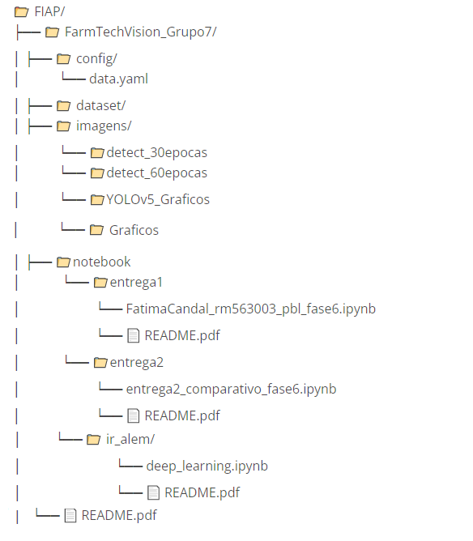
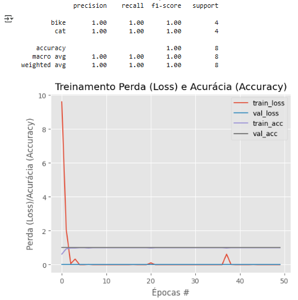
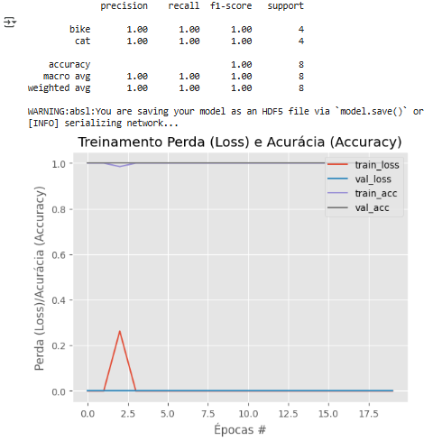

## Projeto FarmTech Solutions – Visão Computacional  Usando Transfer Learning e Fine Tuning

# 📁 **Sobre o Projeto**

## 📌 Projeto FarmTech Solutions – Visão Computacional Usando Transfer Learning e Fine Tuning

Este projeto demonstra as soluções desenvolvidas para as Entrega Ir Além (Usando Transfer Learning e Fine Tuning) da disciplina PBL Fase 6 da FIAP, aplicando técnicas de Visão Computacional com Ir Além (Usando Transfer Learning e Fine Tuning), com foco em dois objetos distintos: **cat** e **bike**. O objetivo é treinar um modelo capaz de identificar esses objetos com alta acurácia, validando seu uso em cenários reais da FarmTech Solutions. 

## 📌 Descrição do Projeto

A FarmTech Solutions está expandindo seus serviços de inteligência artificial
para além do agronegócio, atuando agora nas áreas de saúde animal, segurança
patrimonial, controle de acesso e análise de documentos. Como parte do time de
desenvolvedores, nosso objetivo foi demonstrar na prática o funcionamento de um
sistema de visão computacional utilizando YOLO, com foco em acurácia e
aplicabilidade.

           

# 📹 **Demonstração em Vídeo**

Assista ao vídeo com a explicação e funcionamento do projeto: [FarmTechVision Grupo7 - YouTube]

https://www.youtube.com/watch?v=S_f0_Zrh1Dc

            

## 📌 **Objetivo**

Demonstrar o uso de YOLOv5, YOLOv3 e CNN do zero para detecção de objetos em imagens, com aplicação prática para clientes da FarmTech Solutions.

[FarmTechVision_Grupo7 - Google Drive]

https://drive.google.com/drive/folders/1e6rJrdMxQRRpNJW-nlHGcV0AqA_5cumV

[FIAP/FarmTechVision_Grupo7 at main · rm563003/FIAP · GitHub]

https://github.com/rm563003/FIAP/tree/main/FarmTechVision_Grupo7

            

## 🗂**️** **Estrutura do Repositório GITHUB**

Os arquivos estão no GITHUB:

https://github.com/rm563003/FIAP/tree/main/FarmTechVision_Grupo7

# 🗂**️** DATASET GOOGLE DRIVE

O conjunto de dados foi organizado no Google Drive e contém:

-  **80 imagens no total**

-  40 imagens de gatos (cat)   

-  40 imagens de bicicletas (bike) - Separadas em:

-  32 para treino

-  4 para validação

-  4 para teste

-  Rotuladas com [Make Sense IA] (https://www.makesense.ai/) e salvas no formato YOLO.

## 🔗 Acesse o dataset completo no Google Drive:

https://drive.google.com/drive/folders/1qkNb4RV7mHWI3fwiyvHKzPm7rb9KBSKN

/FarmTechVision_Grupo7/

  └── dataset/

      ├── images/

      │   ├── train/

      │   ├── val/

      │   └── test/

      └── labels/

          ├── train/

          ├── val/

          └── test/

# 🚀 Ir Além (Usando Transfer Learning e Fine Tuning)

## 

# [ir_alem - Google Drive]

(https://drive.google.com/drive/folders/17_g6vLQpcbuGpq_2dsOPohg36Cs1zSG3)

## [FIAP/FarmTechVision_Grupo7/notebook/ir_alem at ec8c5727e5e4b09cd09bbf626f4c78b0c898cd6a · rm563003/FIAP · GitHub]

(https://github.com/rm563003/FIAP/tree/ec8c5727e5e4b09cd09bbf626f4c78b0c898cd6a/FarmTechVision_Grupo7/notebook/ir_alem)

# 📊 1 - Transfer Learning ("Transferência de Aprendizado")

Transfer Learning (ou “Transferência de Aprendizado”) é uma técnica poderosa em aprendizado de máquina que permite reaproveitar o conhecimento de um modelo já treinado em uma tarefa ampla (como classificação de imagens no ImageNet) para resolver uma nova tarefa específica com menos dados e menos tempo de treinamento.

## 📊 Quando usar Transfer Learning:

- Quando seu dataset é pequeno ou difícil de rotular

- Quando você quer resultados rápidos e confiáveis

- Quando sua tarefa é semelhante à do modelo original (ex: imagens naturais)

# 📊 1.1 - Reiniciar o gerador de testes e avaliar a rede após o ajuste fino apenas do cabeçote da rede

## 📊 Relatório de Classificação

Este relatório mostra os resultados de um modelo de classificação binária para as classes **"bike"** e **"cat"**. Os principais indicadores são:

| Métrica       | Bike | Cat  | Média Macro | Média Ponderada |
| ------------- | ---- | ---- | ----------- | --------------- |
| **Precisão**  | 1.00 | 1.00 | 1.00        | 1.00            |
| **Revocação** | 1.00 | 1.00 | 1.00        | 1.00            |
| **F1-score**  | 1.00 | 1.00 | 1.00        | 1.00            |
| **Suporte**   | 4    | 4    | —           | 8               |

✅ **Conclusão**: O modelo teve desempenho perfeito nos dados de teste — classificou corretamente todas as instâncias das duas classes. Isso pode indicar um modelo muito bem ajustado... ou talvez um conjunto de dados pequeno e simples.

               

# 📈 1.2 - Gráfico de Treinamento: Perda e Acurácia

O gráfico mostra a evolução da **perda (loss)** e da **acurácia (accuracy)** ao longo de 50 épocas de treinamento.

- **Linhas vermelha e azul**: perda de treinamento e validação, respectivamente.

- **Linhas cinza e azul claro**: acurácia de treinamento e validação.

🔍 **Observações**:

- A perda cai rapidamente nas primeiras épocas e se estabiliza em valores baixos.

- A acurácia sobe rapidamente e permanece alta (próxima de 1.0) tanto no treino quanto na validação.

- Não há sinais visíveis de **overfitting** (superajuste), já que treino e validação se comportam de forma semelhante.
  
  ## 

## 📈 1.3 - Conclusões

O modelo parece estar funcionando **extremamente bem**, mas vale considerar:

- O conjunto de dados é pequeno (apenas 8 amostras no teste), o que pode inflar artificialmente os resultados.

- A performance perfeita pode indicar que o modelo está **memorizando** os dados em vez de **generalizar**.

# 📊 2 - Fine Tuning ("Ajuste Fino")

Fine Tuning (ou “Ajuste Fino”) é uma técnica avançada dentro do Transfer Learning que permite refinar um modelo pré-treinado para uma tarefa específica. Em vez de treinar uma rede do zero, você aproveita o conhecimento aprendido em um grande conjunto de dados (como o ImageNet) e ajusta parte da rede para se adaptar ao seu problema.

🧠 Por que usar Fine Tuning:

- Aproveita pesos já treinados: acelera o aprendizado e melhora a performance.

- Adapta o modelo ao seu domínio: útil quando seu dataset é diferente do original.

- Evita overfitting: ao congelar partes da rede, você reduz o risco de superajuste.

# 📊 2.1 - Relatório de Classificação

Este relatório mostra o desempenho do modelo em duas classes: **"bike"** e **"cat"**. Os resultados são impressionantes:

| Classe | Precisão | Revocação | F1-Score | Suporte |
| ------ | -------- | --------- | -------- | ------- |
| bike   | 1.00     | 1.00      | 1.00     | 4       |
| cat    | 1.00     | 1.00      | 1.00     | 2       |

- **Acurácia total**: 100% (6 amostras)

- **Média macro e ponderada**: Todas as métricas em 1.00

### 🔍 **Interpretação**:

- O modelo classificou perfeitamente todas as amostras de teste.

- Isso pode indicar um excelente desempenho... ou um conjunto de dados muito pequeno e/ou fácil, o que pode mascarar problemas como overfitting.

# 📈 2.2 - Gráfico de Treinamento: "Perda e Acurácia"

O gráfico mostra a evolução da **perda (loss)** e da **acurácia (accuracy)** ao longo das épocas:

- **Curvas exibidas**:
  
  - `train_loss` e `val_loss`: ambas caem rapidamente, indicando que o modelo aprendeu bem desde o início.
  
  - `train_acc` e `val_acc`: sobem rapidamente e se estabilizam perto de 1.0.

🧠 **Análise**:

- O comportamento sugere que o modelo convergiu rapidamente.

- A validação acompanha bem o treinamento, o que é um bom sinal.

- Mas atenção: com apenas 6 amostras, é difícil avaliar generalização. Pode ser necessário testar com um conjunto maior e mais variado.

# 👥 **Autores**

## Grupo 7 — FIAP

## •       Fátima Vilela Candal

## •       Gabriel Viel dos Santos Delfino

## •       Guilherme Campos Hermanowski

## •       Jonathan Willian Luft

## •       Matheus Alboredo Soares
